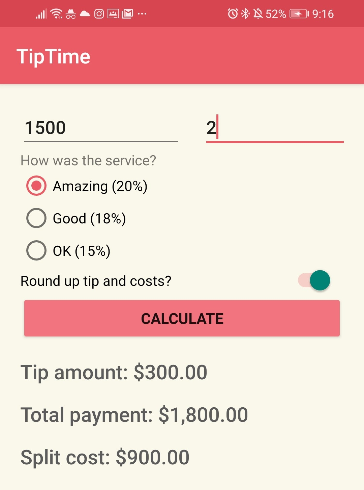

# TipTime
A simple tip app that I am developing for practice.
It is currently under review by Google, and will likely be made public in the next few days!
https://play.google.com/store/apps/details?id=com.gradient.tiptime

The app has the capability to calculate tips out of 3 options, round up values, and split bills!
I decided to make this app to better my Android development skills and for fun.

This app's theme is strawberries/milk.

